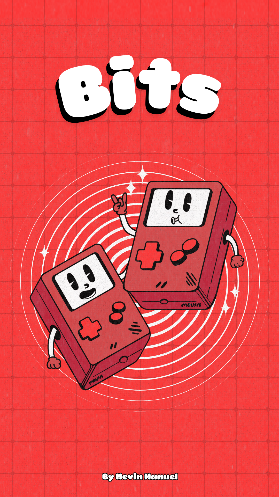
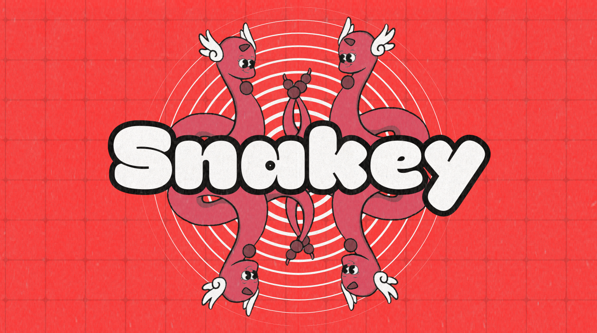
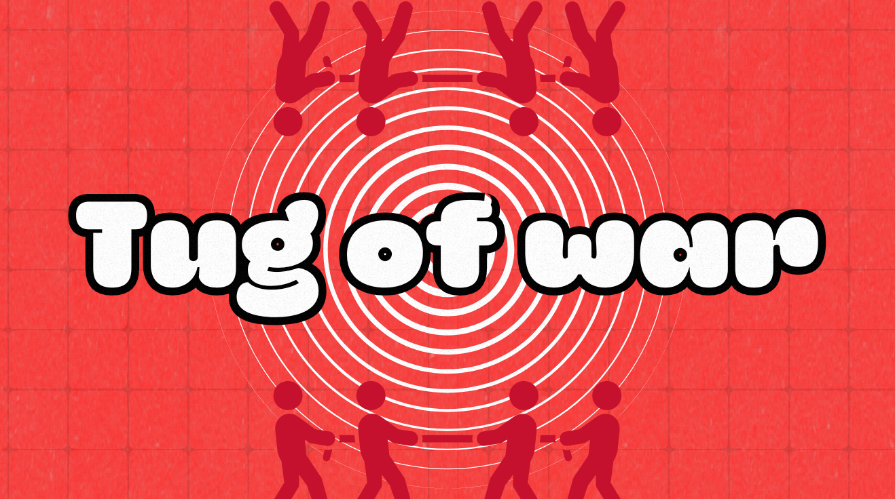
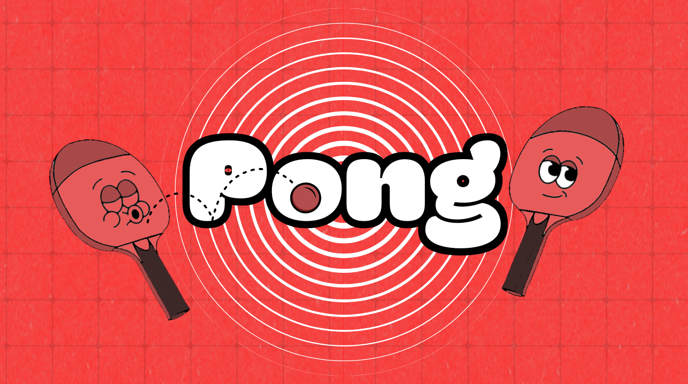
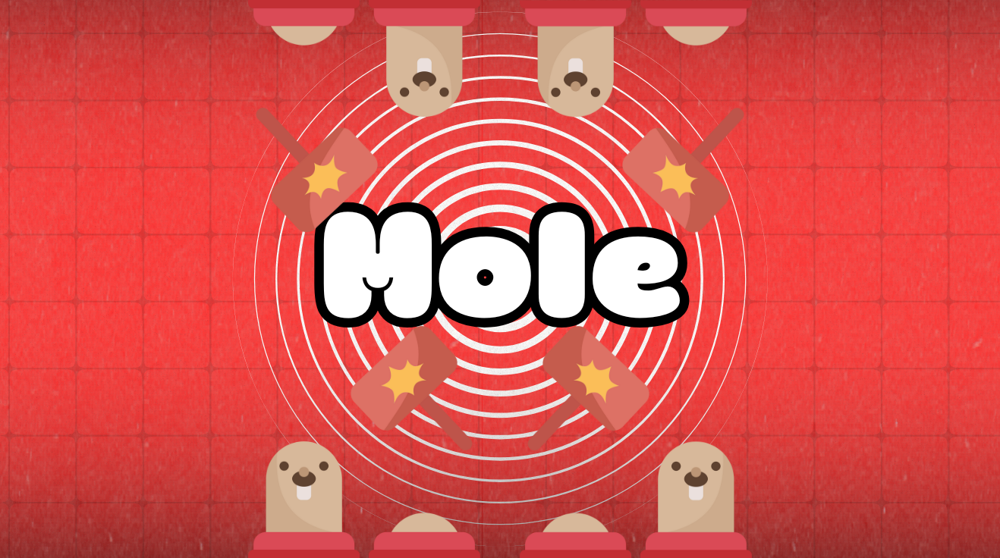
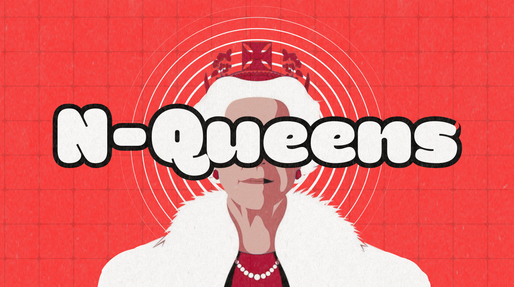

# 🎮 Bits – Multi-Game App

Welcome to **Bits**, an all-in-one gaming app designed to bring classic and fun games under one roof! Whether you're playing solo or challenging a friend in 2-player mode, Bits makes it easy to jump right into the action.

 

---

## ✨ Features

- 🎲 Multiple games in one app
- 🤝 Two-player local multiplayer support
- 🧠 Brain games and reflex tests
- 🎨 Smooth UI with custom-designed interfaces
- ⚡ Built with performance and responsiveness in mind

---

## 🕹 Included Games

- 🐍 **Snake** – Swipe-controlled classic
- 🟩 **2048** – Slide and merge to win
- 🎯 **Wordle Clone** – Guess the 5-letter word
- 👑 **N-Queens** – Solve the legendary chess puzzle
- 🏓 **Pong** – Retro 2-player bounce-off
- 🪢 **tug-of-war** –  2-player tug-of-war
- 🐿️ **Mole** – hit the popping moles


---

## 📱 Screenshots

| Snake Game | tug-of-war | Pong | 2048 | mole | queens |

  |  |  |  |  |  |


---

## 🚀 Tech Stack

- **React Native + Expo** – Cross-platform development
- **Custom React Hooks** – Game logic and gesture handling
- **Modak Font & Theming** – For playful retro aesthetics
- **Framer/Figma** – UI prototyping and design

---

## 🔧 Installation

```bash
git clone https://github.com/yourusername/bits-game-app.git
cd bits-game-app
npm install
npx expo start
```
Requires Node.js and Expo CLI (npm install -g expo-cli)


## 👨‍💻 Author

**Mevin Manuel**  
📧 Mevinmnl123@gmail.com  
🔗 [LinkedIn](https://www.linkedin.com/in/mevin-manuel-b3b670275/)  
🔗 [GitHub](https://github.com/MevinManuel)

---

## 🏁 Roadmap

- [ ] Add global high score system  
- [ ] Add sound effects and vibration feedback

---

## 🔗 Useful Links

- [Expo Documentation](https://docs.expo.dev/)
- [React Native](https://reactnative.dev/)
- [Open Source License Guide](https://choosealicense.com/)

---

## 🧠 What I Learned

- Building multi-screen apps using React Navigation
- Managing game state and animations in React Native
- Designing flexible UI for both web and mobile with Expo
- Handling gesture-based controls and local multiplayer logic

---

## 📄 License

This project is open source and available under the **MIT License**.
